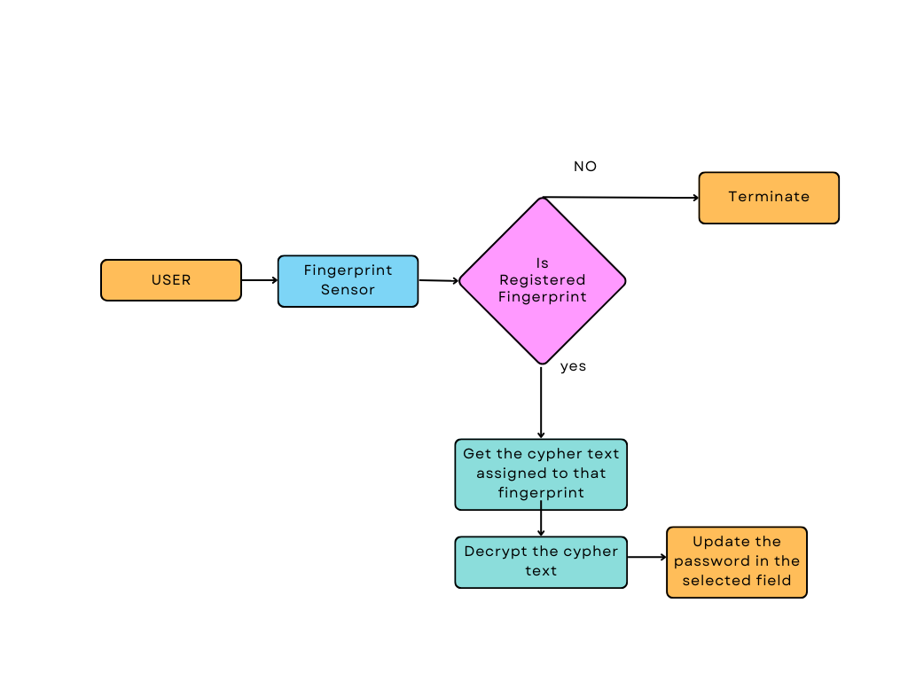

# KRYPTON KEY

- Data breaches and password attacks are increasing day by day. The most common methods for password attacks are “brute force attacks” and “dictionary attacks”

- Can easily reduce/avoid the attacks by made the text into random characters and strict password rules

- But memorising the non readable, random characters of words is not a easy job for all the users

- Our Solution is to developed a device which stores and retrieves the strongest passwords and the password was only stored on the hardware device for high security and access it only with the registered biometric

- Fabricated with 3D printed case using polylactic acid (PLA) material

### Access Flow

### Generate Flow

### Smartlink Flow

